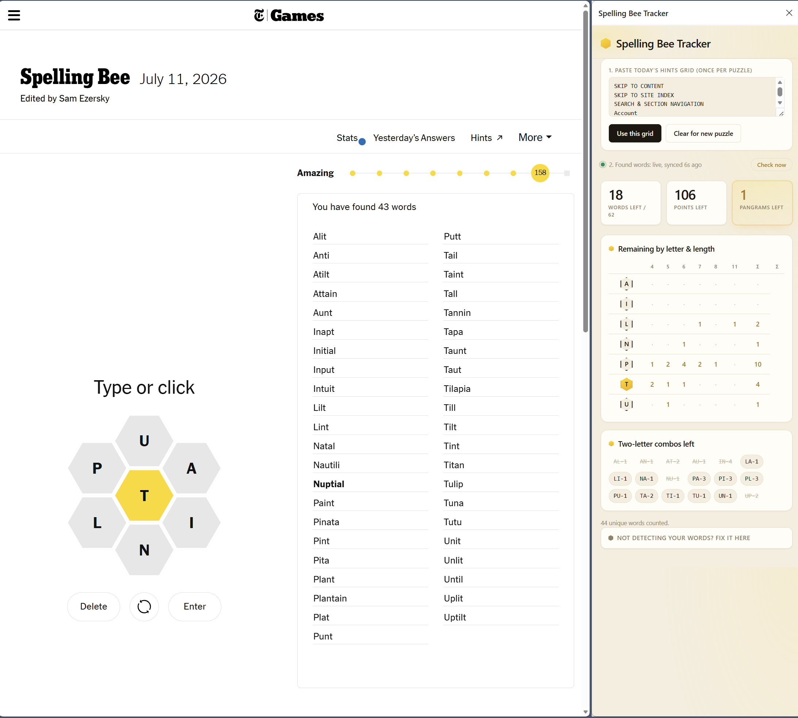

# Spelling Bee Tracker (Chrome / Edge extension)

Side panel that watches the NYT Spelling Bee puzzle tab and the hints tab, and
keeps a live "what's left" grid so you don't have to cross-reference by hand.

## What changed in this version (the real fix)

Confirmed live against the actual puzzle page: the found-words heuristic was
climbing from the "You have found N words" anchor itself, and that sentence
contains three 4+ letter words on its own ("have", "found", "words"). The
old threshold (`>= 3` tokens) was satisfied immediately at the anchor, so it
always returned that same boilerplate sentence, forever, no matter what you
actually typed. `parseFound()` then happily counted "HAVE", "FOUND", "WORDS"
as your found words every single sync. That's the whole bug: it never once
read the real list.

Fixed two ways:
- `FOUND_LIST_SELECTOR` is now hardcoded to `.sb-wordlist-items-pag`, a real
  NYT class confirmed live, so it doesn't need the heuristic at all in the
  normal case.
- The heuristic fallback (used only if that class ever disappears) now
  starts climbing from the anchor's *parent*, not the anchor, and requires
  5+ tokens instead of 3, so it can't false-positive on the boilerplate
  sentence again.

## Other changes in this version

**The bug:** every diagnostic line in `content.js` was logged with
`console.debug(...)`. Chrome DevTools files `console.debug` under the
"Verbose" level, which is hidden when the console filter is on "Default
levels" (the default). So the script was very possibly working the whole
time, it was just logging into a bucket the console wasn't showing. Every
log line is now `console.log`, visible at default levels.

**The bigger fix:** detection no longer depends on a single path. There are
now two independent ways this gets your found-words data:

1. The static content script (`content.js`) still runs continuously on any
   nytimes.com tab and pushes updates on every DOM change, same as before.
2. New: whenever you open the side panel, bring it back into focus, or hit
   the new **Check now** button, it asks `background.js` to actively find
   your nytimes.com tab and inject a fresh scrape into it right then, via
   `chrome.scripting.executeScript`. This does not depend on the static
   content script having loaded at all, so if that's ever silently broken
   again, this path still works.

This also directly covers "I haven't touched this in days, or played from my
phone, is it still accurate": every time you open the panel, it re-checks the
live page instead of trusting whatever was last cached.

## Install (Chrome)

1. Unzip this folder somewhere permanent (don't delete it after installing;
   Chrome loads the extension from this folder every time it starts).
2. Go to `chrome://extensions`.
3. Turn on **Developer mode** (top right).
4. Click **Load unpacked**, and select this folder.
5. Pin the extension (puzzle-piece icon in the toolbar > pin).

If you're updating from a previous install: click the reload icon on the
extension's card in `chrome://extensions`, then reload any open NYT tabs.
New permissions (`scripting`, `tabs`) mean Chrome may ask you to review the
permission change on first reload; that's expected.

## Install (Edge)

Same steps, at `edge://extensions` instead.

## Use it

1. Click the extension's toolbar icon to open the side panel.
2. Paste today's hints grid text (the letter/length grid from the NYT hints
   page) into the box at the top and click **Use this grid**. You do this
   once per puzzle; it doesn't change while you play.
3. Open today's Spelling Bee in a tab and play normally. The panel keeps
   itself in sync automatically, both continuously while the tab is open and
   actively whenever you open or refocus the side panel.

Hit **Check now** any time you want to force an immediate re-check instead
of waiting.

## Troubleshooting the auto-detection

Open DevTools on the puzzle tab (F12, or right-click > Inspect) and check the
Console tab for lines starting with `[SB Tracker:content]`. Also worth
checking `[SB Tracker:bg]` (open via `chrome://extensions` > this extension's
card > **service worker** link) and `[SB Tracker:panel]` (DevTools on the
side panel itself).

- **You don't see `[SB Tracker:content] script loaded` at all, on any
  reload** — the content script isn't running on that frame. Confirm the
  extension is enabled and was reloaded after any edits, then reload the
  puzzle tab (content scripts only inject on page loads that happen after
  the extension is active, not retroactively into tabs that were already
  open). Also check `chrome://extensions` for a red "Errors" button on the
  card.
- **You see the script-loaded line, but never
  `found-words container located`** — NYT changed the wording of the "You
  have found N words" heading, or restructured the page enough that the
  container-climbing heuristic doesn't find a plausible word list nearby.
  Right-click the actual word list, Inspect, and set `FOUND_LIST_SELECTOR`
  in `content.js` to a stable class/data-attribute on that container.
- **Check now always says "no open NYT Spelling Bee tab found"** — this
  checks for any tab whose URL matches `*://*.nytimes.com/*`, preferring one
  with `spelling-bee` in the URL. Make sure the puzzle tab is actually open
  in this same browser profile.
- **`[SB Tracker:bg]` shows `executeScript failed`** — usually a permissions
  issue after updating the manifest; go to `chrome://extensions`, remove and
  re-load-unpacked the folder fresh.

In all cases, reload the extension from `chrome://extensions` after editing
any file, then reload the puzzle tab.

As a backup any time, you can paste your found words directly into the
fallback box in "Not detecting your words? Fix it here," which still runs
the same doubled-word cleanup as before.

## Notes

- Nothing here leaves your machine. No network requests, no accounts, no
  analytics. The on-demand sync only talks to your own open nytimes.com tab.
- Because the side panel reads the DOM directly instead of doing a manual
  clipboard copy, it sidesteps the "beefbeef" double-word bug from copying
  the two-column list by hand. The manual fallback still has the cleanup
  step in case you ever do paste that way.
- If NYT ever changes the puzzle URL, add it to `matches` and
  `host_permissions` in `manifest.json`.

  ##Screenshot
  
